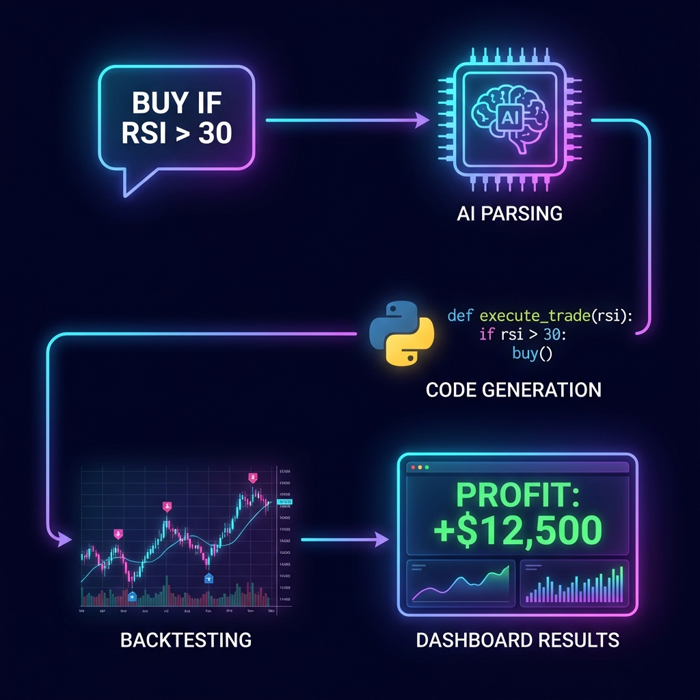

# Finacal Adviser

**Finacal Adviser** is an advanced AI-powered trading strategy generator. It converts natural language trading rules into executable, backtested strategies with a beautiful, interactive dashboard.

## Live Demo & Links

- **Website/Live Demo:** [https://finacal-adviser.vercel.app/](https://finacal-adviser.vercel.app/)
- **Source Code (GitHub):** [https://github.com/AnshulParate2004/Finacal_Adviser](https://github.com/AnshulParate2004/Finacal_Adviser)

## Process Flow

Here is how the AI processes your trading requests:

## Features

-   **Natural Language to Strategy**: Type rules like *"Buy when RSI > 70 and sell when RSI < 30"* and watch them turn into code.
-   **Real-time Backtesting**: Instant performance analysis on historical data.
-   **Interactive Dashboard**: Visualizes trades, equity curves, and performance metrics.
-   **Advanced NLP**: Powered by Google Gemini to understand complex trading logic.
-   **Premium UI**: Built with React, Tailwind CSS, and Framer Motion for a smooth experience.

## Architecture

The project consists of two main components:

-   **Frontend (`/Frontend`)**: A modern React application built with Vite.
-   **Backend (`/nlp-to-strategy-engine`)**: A FastAPI server handling NLP parsing, DSL conversion, and backtesting.
